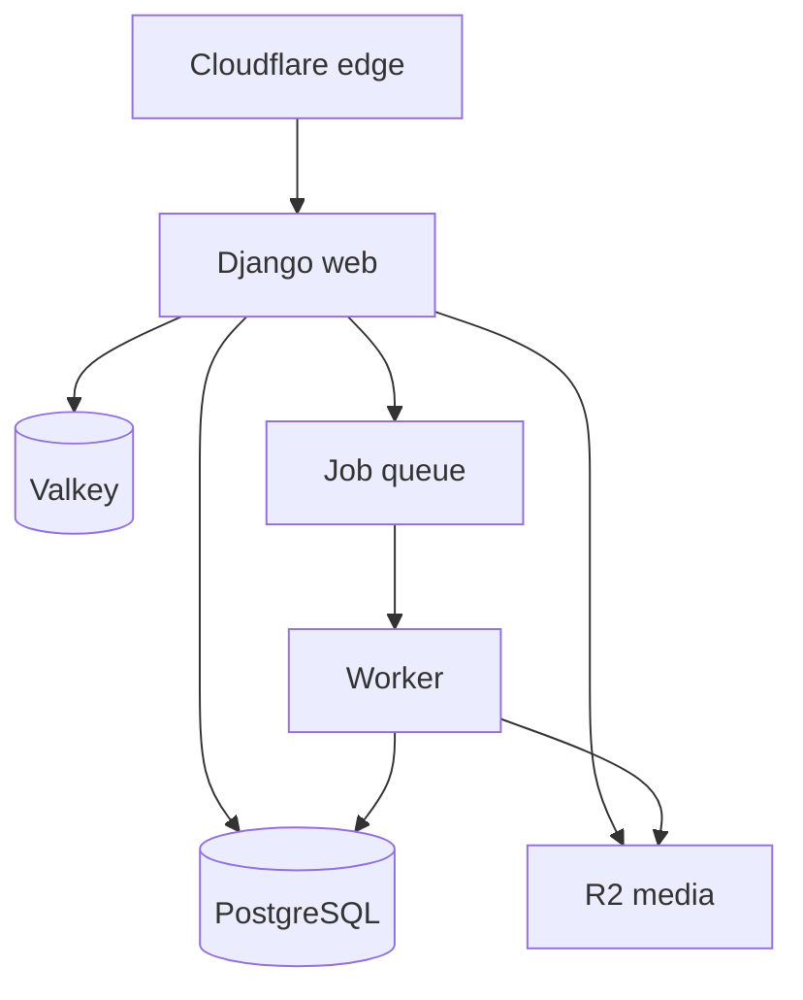

# Architecture

## Stack

| Layer | Choice |
|---|---|
| Runtime | Python 3.13, Django 5.2 LTS, Gunicorn + Uvicorn worker |
| Web UI | Django templates, HTMX, minimal Alpine.js, Tailwind CSS |
| Data | PostgreSQL 18; full-text search + `pg_trgm` |
| Cache/limits | Valkey 8.x through Django cache; fail safe by feature |
| Jobs | Celery worker + Valkey; transactional outbox for critical dispatch |
| Media | S3-compatible Cloudflare R2; transformed WebP/AVIF variants |
| Edge | Cloudflare DNS/CDN/WAF → Nginx → web containers |
| Email | Provider adapter; production provider chosen by deliverability test |
| Errors/ops | Sentry, structured JSON logs, Prometheus-compatible metrics |
| Delivery | Docker Compose, GitHub Actions, immutable image tags |

Django 5.2 is chosen over the newest feature release because its security support runs through April 2028. Upgrade within the LTS patch line promptly.

## Shape



One repository and deployable application; web and worker are separate processes from the same image. Extract a module only after measured independent scaling or ownership pressure.

## Domain modules

| Module | Owns |
|---|---|
| `accounts` | provider/staff identity, sessions, roles |
| `taxonomy` | categories, cities, regions, languages |
| `providers` | provider identity, services, areas, contacts, media |
| `publishing` | drafts, immutable revisions, lifecycle and slugs |
| `verification` | checks, evidence metadata, expiry |
| `moderation` | cases, reports, decisions and audit events |
| `discovery` | search document, ranking and public read models |
| `analytics` | event ingestion, daily aggregates, provider dashboards |
| `content` | legal/trust/SEO copy and translations |

Modules may read public selectors from another module. Writes cross boundaries through service functions inside transactions. Async work starts only after transaction commit.

## Core model

```text
Account ──< ProviderMembership >── Provider
Provider ──< ProviderService >── Category
Provider ──< ServiceArea >── Municipality
Provider ──< ProviderLanguage >── Language
Provider ──< ContactChannel
Provider ──< MediaAsset
Provider ──< ProfileRevision
Provider ──< VerificationCheck
Provider ──< ModerationCase ──< ModerationEvent
Provider ──< AnalyticsEvent -> DailyProviderMetric
```

`Provider` supports `individual` and `business`; membership supports future teams. Public pages read only an approved revision/read model. Soft state (`draft`, `pending`, `published`, `changes_requested`, `suspended`, `archived`) is explicit. IDs are UUIDv7; public slugs are stable and redirects preserve prior slugs.

## Search and ranking

- Normalize Unicode, case, Finnish/Russian aliases and category synonyms at write time.
- Exact filters use relational indexes; text uses weighted `tsvector` plus trigram fallback.
- Generate a denormalized search document on publish, not per request.
- Query with bounded page size and keyset pagination; no unbounded counts.
- Ranking inputs are testable and visible; never infer protected traits.

External search is introduced only when PostgreSQL fails a recorded relevance or latency gate.

## Contact analytics

Public buttons point to an opaque internal route such as `/go/{provider}/{channel}`. The server resolves only a stored structured target, records a minimal event, and returns `302`. It never accepts a destination URL from the request. Phone/email values are excluded from logs.

## Cache contract

| Surface | Policy |
|---|---|
| Static assets/media | immutable hashed assets, 1 year |
| Taxonomy/home | CDN 1 hour, stale-while-revalidate |
| City/category/profile | CDN 5 minutes, stale-while-revalidate 24 hours |
| Normalized search | application cache 1–5 minutes; CDN only for allowlisted keys |
| Account/admin/auth | `private, no-store` |

Publish/suspend updates the read model, invalidates related Valkey keys and purges known CDN URLs. TTL remains a safety net. Authentication cookies force cache bypass.

## Deployment growth path

1. One EU VPS: Nginx, 2 web workers, 1 job worker, PostgreSQL, Valkey; R2 external.
2. Move PostgreSQL to a dedicated host when CPU/IO/backup windows justify it.
3. Scale stateless web/worker replicas.
4. Add read replica or external search only from measured bottlenecks.

No Kubernetes or microservices in MVP.
